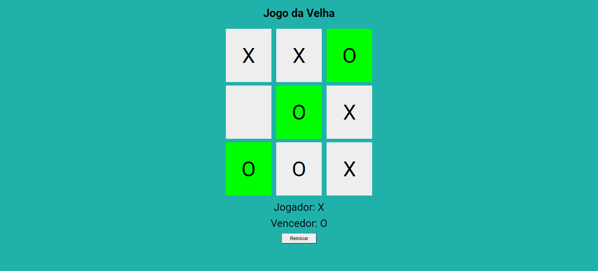

<h1>jogo_da_velha</h1>

Construindo o  jogo da velha com fundamentos Front-End e lógica de programação. 
 

 <h2>Tecnologias</h2> 
<ul>
 
  <li>HTML5</li>
  <li>CSS3</li>
  <li>JavaScript</li>
   
</ul>

